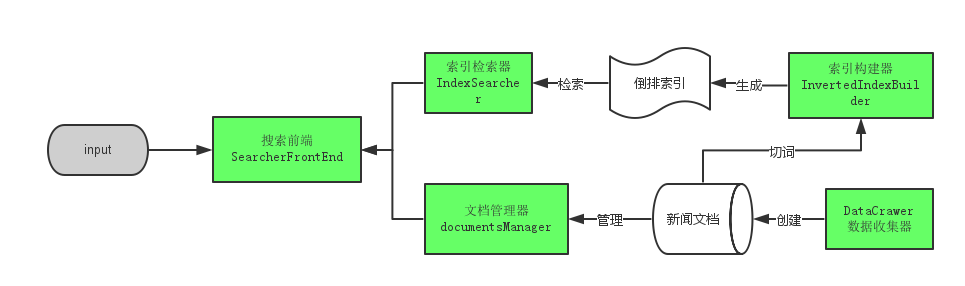
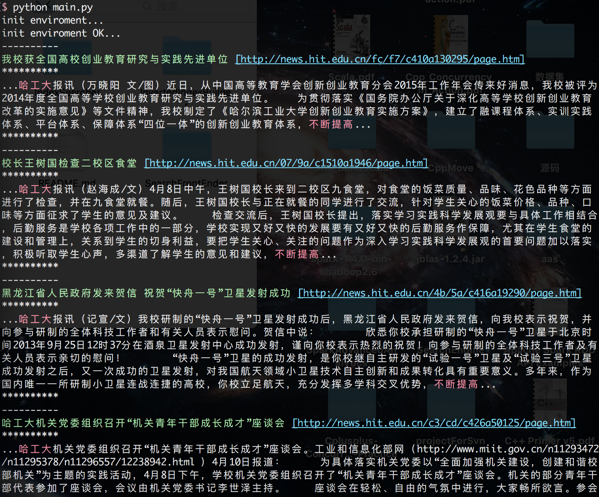

#简易搜索引擎系统

###基本概况

- 基于Python实现 
- 面向新闻标题、正文 
- 数据抓取自“今日哈工大”网（因为我砍后台没反爬虫） 
- 新闻数量37251个 
- 闲暇之余写的，没什么太高端的东西。。。 

###系统架构

###系统代码目录

`DataCrawer`：哈工大新闻抓取模块，基于urllib； 
`DocumentsManager`：新闻文档管理模块，提供根据新闻id获得新闻； 
`SearchFrontEnder`：搜索前端模块，主要接受用户输入，切词->查询倒排索引->取出对应文档->排序->输出； 
`InvertedIndexBuilder`：索引器构建模块，对已爬取文档构建倒排索引，按B树形式存储； 
`IndexSearcher`：索引器模块，从B树获取词元对应的倒排索引； 
`Utils`：其他函数；如计算词的IDF等。。。

###基本流程
先进入DataCrawer目录，分别执行：
python crawlHITnewsUrls.py 进行获取新闻的Urls
python crawlHITnews.py 对新闻进行爬取、存储

进入Documents目录，执行
python createDocumentDir.py 进行分类存储、方便文档管理器进行管理

进入InvertedIndexBuilder目录，执行：
python createSubInvertedIndex.py 创建倒排索引，并按B树存储；

进入Utils目录，执行：
python computeIDF.py 为所有词计算IDF，存起来；

然后搜索引擎就可以使用了，回到主目录，在main.py文件内写自己要搜索的句子，然后执行：
python main.py得到搜索结果，比如搜索**`不断提高 哈工大`**结果如图：

###相关技术

- 利用urllib、beautifulSoup来爬取新闻；
- 利用2-gram进行词元切分，并构建倒排索引；
- 利用B树做词典，检索倒排索引；
- 用户输入内容的词元对应索引取交集，获得候选索引；
- 利用词元的TF*IDF判断新闻内容与用户输入的相似度，对候选索引进行排序，然后选出前K个；

###联系
Email：`leechan8@outlook.com`
